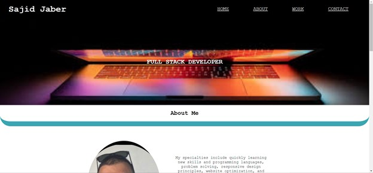
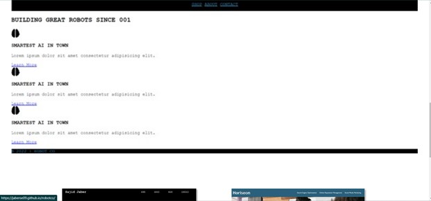
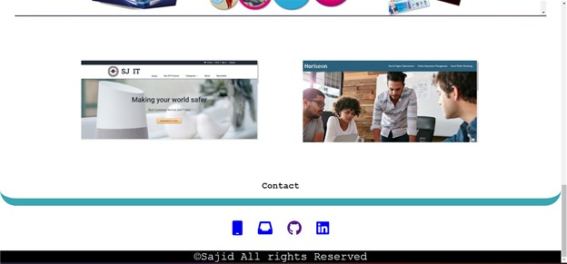

# 2-02-challenge Portfolio Website

## Description

Created a responsive website for all devices for my portfolio
The nav consists of my name and four links
    HOME
    ABOUT
    WORK 
    CONTACT
Each goes to a id in the webpage
Then there is a hero section where full stack developer is centered
Each section has a h2 tag and a hr that breaks up the sections
First section has a photo and a bio of me
Second section has a feature work and tow works under it and each image keads to the website made
Contact is the least section where you can call , email  view github or see linkdin
footer at bottum


## Table of Contents

* [Installation](#installation)
* [Usage](#usage)
* [Credits](#credits)
* [License](#license)


## Installation
https://jaberse09.github.io/2-02-challenge/ is the link to the work
just ckone the repo and run the index.html 

## Usage

```md

```
At the top of the page is the nav bar and hero image

```md

```
work section has two rows and freature work full width

```md

```
footer documented the rights


## Credits
Sajid Jaber
## License
MIT License

Copyright (c) [2022] [Sajid Jaber]

Permission is hereby granted, free of charge, to any person obtaining a copy
of this software and associated documentation files (the "Software"), to deal
in the Software without restriction, including without limitation the rights
to use, copy, modify, merge, publish, distribute, sublicense, and/or sell
copies of the Software, and to permit persons to whom the Software is
furnished to do so, subject to the following conditions:

The above copyright notice and this permission notice shall be included in all
copies or substantial portions of the Software.

THE SOFTWARE IS PROVIDED "AS IS", WITHOUT WARRANTY OF ANY KIND, EXPRESS OR
IMPLIED, INCLUDING BUT NOT LIMITED TO THE WARRANTIES OF MERCHANTABILITY,
FITNESS FOR A PARTICULAR PURPOSE AND NONINFRINGEMENT. IN NO EVENT SHALL THE
AUTHORS OR COPYRIGHT HOLDERS BE LIABLE FOR ANY CLAIM, DAMAGES OR OTHER
LIABILITY, WHETHER IN AN ACTION OF CONTRACT, TORT OR OTHERWISE, ARISING FROM,
OUT OF OR IN CONNECTION WITH THE SOFTWARE OR THE USE OR OTHER DEALINGS IN THE
SOFTWARE.